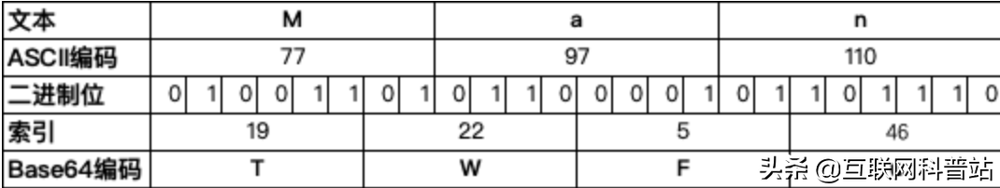
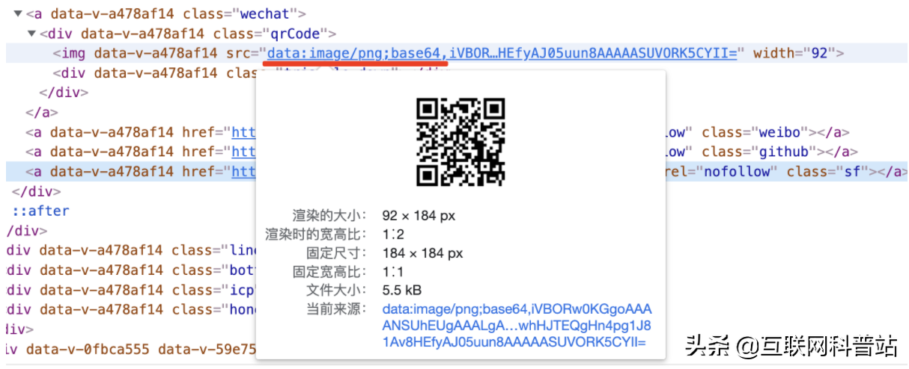
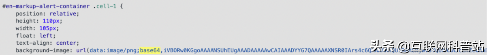

## 密码学基础

### 什么是 Base64
Base64 是网络中存储和传输的二进制数据的普遍用法。Base64 一个字节只能表示 64 种情况，且编码格式每个字节的前两位都只能是 0，使用剩下的 6 位表示内容。

### 这种编码格式无法充分利用存储资源，效能较低。那为什么还会成为网络中的普遍用法呢？
其实 Base64 最早是应用在邮件传输协议中的。当时邮件传输协议只支持 ASCII 字符传递，使用 ASCII 码来表示所有的英文字符和数字还有一些符号。这里有一个问题，如果邮件中只传输英文数字等，那么 ASCII 可以直接支持。但是如果要在文件中传输图片、视频等资源的话，这些资源转成 ASCII 的时候会出现非英文数字的情况。
而且邮件中还存在很多控制字符，这些控制字符又会成为不可见字符。非英文字符和控制字符在传输过程中很容易产生错误，影响邮件的正确传输。为此才有了诞生了一个新的编码规则，把二进制以 3 个字节为一组，再把每组的 3 个字节（24 位）转换成 4 个 6 位，每 6 位根据查表对应一个 ASCII 符号，这就是 Base64

## 示例
Base64 将 8 位为一个单元的字节数据，拆分为 6 位为一个单元的二进制片段。每一个 6 位单元对应 Base64 索引表中的一个字符。简单举个例子，下图中 M 的 ASCII 码是 77 , 而转换为二进制后前六位二进制对应值为 19，为 Base64 字典中的 T。

当然这里也会有一个问题，如果要编码的二进制数据不是 3 的倍数，那就会剩下一至二个字节。为此 Base64 使用 000000 字节值在末尾补足，使其字节数能够被 3 整除，补位用 = 表示，= 的个数可表示补了多少字节，并在解码时自动去除。总体来看相比编码前，Base64 编码后的字符增加了约 33%。

## 图片的 Base64 编码
我们都知道图片在网页中的使用方法通常是使用 img 标签的形式，而 img 标签的 src 属性会指定一个远程服务器上的资源。在网页加载到浏览器中时，浏览器会针对每个外部资源都向服务器发送一次拉取资源请求。但是这是非常占用网络资源的，而且因为大多数浏览器都有并发请求数的限制，如果你的网页中嵌入了过多外部请求，就很容易出现页面加载速度过慢的情况。
而 Base64 编码可以通过 Data URL 技术让图片以字符串的格式直接嵌入页面，与 HTML 成为一体。这样在加载时就可以避开对外部资源的请求
## 为什么选择 Data URL
* 减少 HTTP 请求；
* 避免跨域问题；
* 可像单独图片一样使用，比如背景图片重复使用等。

可以明显看到 Base64 编码将一幅图片数据编码成一串字符串，并使用该字符串代替图像地址。尽管乍一眼看上去没有任何图片相关的内容，但它最终渲染出的毫无疑问是一张完整的图片效果。
## 使用 Data URL 来进行 Base64 图片编码并不是完美的，它有着两个不容忽视的缺点：
* Base64 编码的数据体积通常是原数据的体积 4/3，也就是 Data URL 形式的图片会比二进制格式的图片体积大 1/3
* Data URL 形式的图片不会被浏览器缓存

## 无法被浏览器缓存也就意味着每次访问都需要重新请求资源，这对于服务器压力是比较大的。那有没有办法，能将这些数据也放入浏览器缓存中呢？

## 加快加载小技巧
其实大部分网站的背景图构成，是一个宽高只有几个像素的小图片，通过将它平铺成为背景图。通常我们将小图片保存成 GIF 或 PNG 格式，然后在 CSS 的 background-image 属性中引用图片地址。但是浏览器本身并不在意 URL里写的是什么，只是需要通过它获取需要的数据。 所以我们完全可以使用 CSS 样式文件，让 Data URL 形式的图片存储在 CSS 样式表中。这样浏览器就会缓存 CSS 文件，也就会缓存图片，能够进一步提高页面加载效率。

上图就是一个简单的使用案例，通过这种方式既避免了让背景图片独自产生一次 HTTP 请求的情况，还让背景图片和 CSS 文件一起被浏览器缓存起来，避免了每次打开网页都加载一次背景图片的情况，让改善用户的浏览体验更为快速流畅。
通过 Date URL 技术与 Base64 编码的结合有效减少 HTTP 请求，让用户访问体验更好，这其实是我们一个开发过程中的小技巧